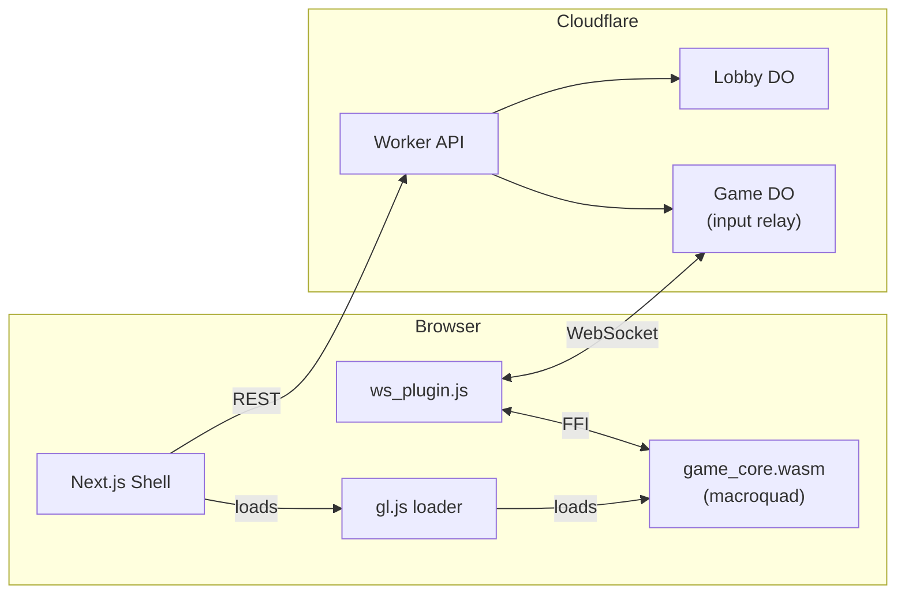

# Fresh Worms Game Rebuild with macroquad

## What we keep (unchanged)

- **Cloudflare Worker**: [apps/worker/src/lobby.ts](apps/worker/src/lobby.ts), [apps/worker/src/game.ts](apps/worker/src/game.ts), [apps/worker/src/registry.ts](apps/worker/src/registry.ts), [apps/worker/src/index.ts](apps/worker/src/index.ts) -- lobby creation, join codes, WebSocket relay, bot turns
- **Next.js lobby/join flow**: [apps/web/src/app/lobby/[id]/LobbyContent.tsx](apps/web/src/app/lobby/[id]/LobbyContent.tsx), [apps/web/src/app/join/[code]/JoinContent.tsx](apps/web/src/app/join/[code]/JoinContent.tsx), home page, layout, Toast system
- **Shared infra**: [apps/web/src/lib/ws.ts](apps/web/src/lib/ws.ts), [apps/web/src/lib/api.ts](apps/web/src/lib/api.ts), wrangler.toml, worker deploy pipeline

## Architecture



**How it works**: macroquad owns the entire game -- rendering, input, physics, camera, HUD. It renders directly to a WebGL canvas via miniquad. A JavaScript plugin (`ws_plugin.js`) bridges WebSocket messages between the Cloudflare Game DO and the WASM module via FFI. The Next.js game page is a thin shell that sets up the canvas and loads the scripts.

## Rust game-core rewrite

Delete all existing `.rs` files. The new structure:

```
packages/game-core/
  Cargo.toml         -- macroquad dependency, binary crate
  src/
    main.rs          -- macroquad game loop, Game struct, orchestration
    terrain.rs       -- procedural generation, destruction, texture baking
    physics.rs       -- worm physics, gravity, collision, walking
    projectile.rs    -- projectile flight, explosion damage + knockback
    weapons.rs       -- weapon definitions (Bazooka, Grenade, Shotgun)
    camera.rs        -- camera follow, pan, zoom, smooth lerp
    state.rs         -- Phase enum, turn management, game over detection
    network.rs       -- extern "C" FFI bridge for WebSocket plugin
    hud.rs           -- HUD: health bars, turn indicator, weapon picker, power meter, timer
```

### Key design decisions

- **Cargo.toml**: `macroquad = "0.4"` as sole dependency (it pulls in miniquad, serde not needed since we use simple JSON strings via FFI). Crate type is binary (`[[bin]]`), not cdylib.
- **Terrain**: 1600x800 pixel grid stored as `Vec<u8>` (air/dirt/grass/stone). Generated procedurally with hills, platforms, and caves. Baked into a `Texture2D` once on init and re-baked on explosion. Water drawn as an animated blue band at the bottom.
- **Physics**: Fixed-point integers (x100 scale). Gravity, ground collision with slope climbing, air friction, fall damage, water death. Reuse the general approach from the existing `physics.rs`.
- **Turn system**: Phases are `Movement -> Aiming -> Charging -> ProjectileFlying -> Settling -> TurnEnd -> (next player)`. 45-second turn timer. Active player can move, aim, fire once per turn.
- **Input**: macroquad's `is_key_down`/`is_key_pressed` for movement (WASD/arrows), jump (W/Space), weapon select (1-3). Mouse position for aim direction. Left-click to start charging, release to fire. E to end turn.
- **Camera**: Follows active worm with smooth lerp. Follows projectile during flight. Right-drag to pan, scroll to zoom. Implemented with macroquad `Camera2D`.
- **Rendering**: macroquad `draw_texture` for terrain, `draw_circle`/`draw_rectangle` for worms/projectiles, `draw_line` for aim indicator, `draw_text` for HUD. All GPU-accelerated via WebGL.
- **Multiplayer sync**: Deterministic simulation. Each client runs the full game. Inputs (fire, move, end_turn) are sent to the Game DO which broadcasts to all clients. On receive, inputs are applied locally.

### FFI / WebSocket bridge

The JS plugin (`ws_plugin.js`) uses the miniquad plugin system:

- **JS -> Rust**: When a WebSocket message arrives, JS calls `wasm_exports.on_ws_message(ptr, len)` after writing the message string into WASM memory
- **Rust -> JS**: Rust calls `extern "C" fn send_ws_message(ptr, len)` which the plugin reads from WASM memory and sends via WebSocket
- **Initialization**: The plugin reads `gameId` and `playerId` from URL search params, `playerOrder` from `sessionStorage`, connects the WebSocket on load, and calls `wasm_exports.on_game_init(...)` with the init data

## Web integration changes

### Game page ([apps/web/src/app/game/[id]/page.tsx](apps/web/src/app/game/[id]/page.tsx))

Rewrite to a minimal page that renders:

```html
<canvas id="glcanvas" tabindex="1" />
<script src="/js/gl.js"></script>
<script src="/js/ws_plugin.js"></script>
<script>
  load("/wasm/game_core.wasm");
</script>
```

The Next.js page wraps this in a `useEffect` to dynamically inject the scripts.

### Files to delete

- [apps/web/src/components/game/GameCanvas.tsx](apps/web/src/components/game/GameCanvas.tsx) -- replaced by macroquad rendering
- [apps/web/src/app/game/[id]/GameContent.tsx](apps/web/src/app/game/[id]/GameContent.tsx) -- replaced by thin page

### Files to add

- `apps/web/public/js/gl.js` -- miniquad's WASM loader (from [miniquad repo](https://not-fl3.github.io/miniquad-samples/gl.js))
- `apps/web/public/js/ws_plugin.js` -- custom WebSocket bridge plugin

## Build pipeline

Update [package.json](package.json) `build:game` script:

```
cd packages/game-core && cargo build --release --target wasm32-unknown-unknown && mkdir -p ../../apps/web/public/wasm && cp target/wasm32-unknown-unknown/release/game-core.wasm ../../apps/web/public/wasm/game_core.wasm
```

Update `deploy:web` accordingly. Remove `wasm-pack` dependency.

Update dev WASM watch script (`watch-wasm.mjs`) to use `cargo build` instead of `wasm-pack`.

## Implementation order

The tasks below are ordered so the game is playable at each stage (terrain visible after task 2, controls working after task 3, full game after task 5).
